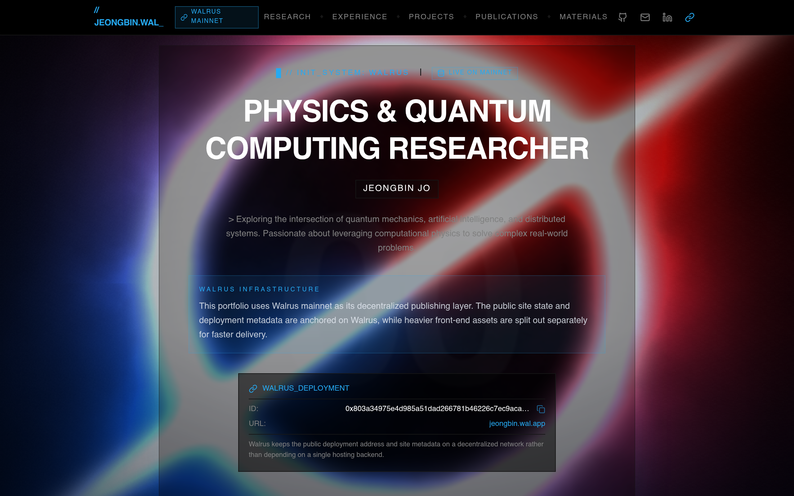
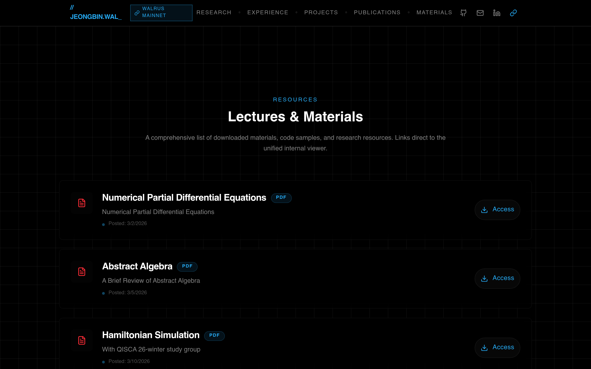
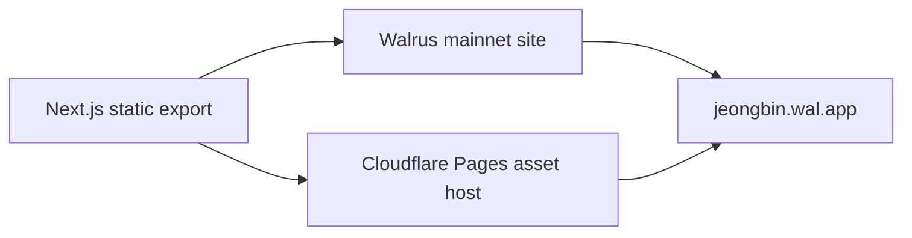

# Jeongbin Walrus Portfolio

Public submission repository for the Walgo Site Builder hackathon.

Live links:

- Walrus mainnet: [https://jeongbin.wal.app](https://jeongbin.wal.app)
- Cloudflare mirror: [https://jeongbin.pages.dev](https://jeongbin.pages.dev)
- Walrus Site Object ID: `0x803a34975e4d985a51dad266781b46226c7ec9aca29557db6014e5474347dd41`

## Overview

This project is a personal portfolio and research site built with Next.js and exported as a static site, then published on Walrus mainnet.

The site focuses on:

- research and technical writing in physics and quantum computing
- curated project presentation instead of raw repository cards
- community-facing ecosystem work such as the Sui Dev Korea contribution
- Walrus-native publishing with a public `wal.app` address

## Why Walrus

Walrus is used here as the decentralized publishing and metadata layer.

- the public site is available through `jeongbin.wal.app`
- deployment metadata is anchored to a Walrus site object on mainnet
- routeable static pages are published on Walrus instead of depending on a single traditional host
- heavier front-end assets are split to Cloudflare Pages for faster delivery while the main public address stays on Walrus

## Screenshots

### Home



### Materials



## Featured pieces

- `Sui Dev Korea Community Hub`: ecosystem-facing contribution highlighted as the main featured project
- `Hybrid Quantum Diffusion Models`: research software connecting quantum ML ideas to a public preprint
- `Materials`: lecture and study resources collected into a browsable academic section
- `Research / Publications`: research identity, review work, and reading outputs structured as a portfolio instead of a generic resume page

## Stack

- Next.js 16
- React 19
- Tailwind CSS 4
- Walrus mainnet
- SuiNS domain mapping
- Cloudflare Pages for externalized static assets

## Architecture



## Local development

```bash
npm install
npm run dev
```

Open [http://localhost:3000](http://localhost:3000).

## Notes on this public repo

This repository is intentionally sanitized for public submission.

Removed from this public copy:

- wallet files and keystores
- private environment variables
- local Walrus and site-builder binaries
- scratch scripts and local deployment logs
- private deployment configs tied to the original machine
- bundled PDF artifacts and local LaTeX build outputs

The deployed live site remains verifiable through the public Walrus URL and Site Object ID listed above.
